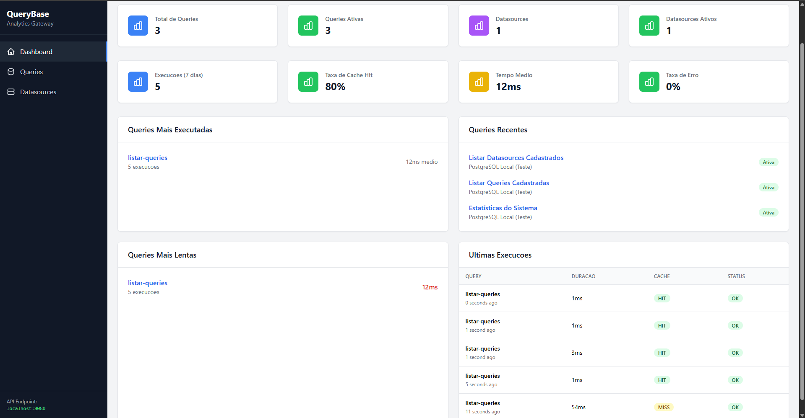
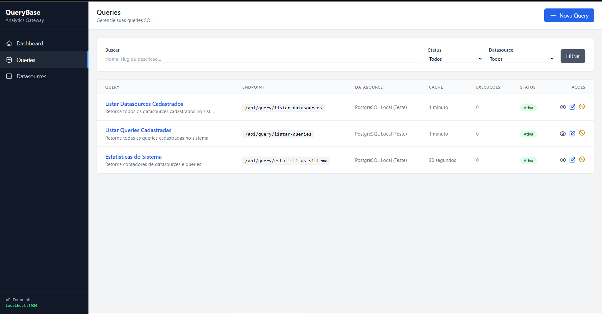
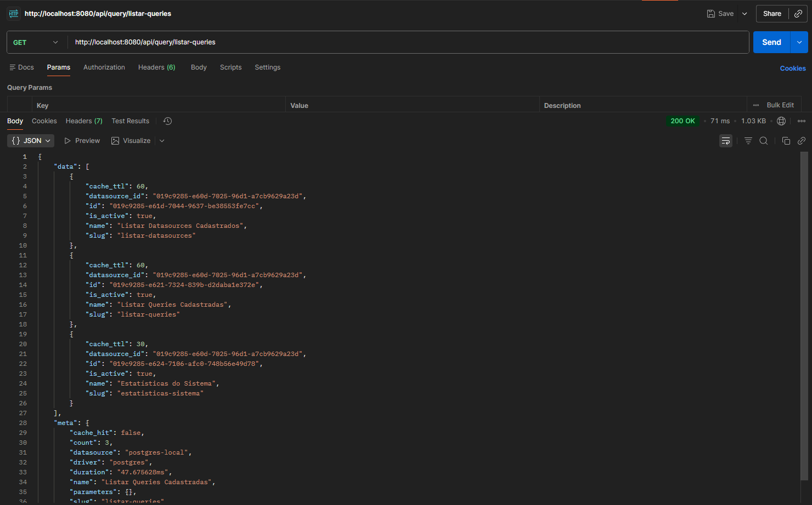

# QueryBase

> Gateway de API multi-fonte para análises de negócio — protegendo suas bases de produção enquanto mantém suas análises rápidas.

[](https://golang.org)
[](https://laravel.com)
[](https://redis.io)
[](LICENSE)

---

## Problema que Resolve

Em ambientes onde ferramentas de BI (Power BI, Tableau, Excel) conectam diretamente em bancos de produção, surgem problemas críticos:

- **Performance degradada** — Queries pesadas impactam aplicações em produção
- **Credenciais expostas** — Senhas de produção distribuídas sem controle
- **Zero rastreabilidade** — Impossível saber quem executou qual query e quando
- **Sem cache** — Mesmas queries pesadas executadas repetidamente

---

## A Solução

Um gateway inteligente que fica entre suas ferramentas de análise e os bancos de produção:

```
Power BI / Tableau / Excel
         ↓
   QueryBase API (Go)
    ├── Cache Redis
    ├── Connection Pool
    └── Criptografia
         ↓
Oracle / PostgreSQL / MySQL
```

**Benefícios:**
- **Performance**: Cache Redis reduz queries repetitivas de ~3s para ~50ms
- **Segurança**: Credenciais criptografadas (AES-256-GCM), nunca expostas
- **Controle**: Gestão centralizada de acessos e queries
- **Reutilização**: Biblioteca de queries SQL compartilhada entre equipes

---

## Screenshots

### Dashboard



### Gestão de Queries



### Detalhes de uma Query


### Resposta da API



---

## Arquitetura

### querybase-web (Laravel 10 + PHP)
Interface administrativa para gestão:
- CRUD de datasources (conexões de banco)
- CRUD de queries SQL reutilizáveis
- Criptografia AES-256-GCM de credenciais
- Testes de conexão em tempo real
- Dashboard com métricas

### querybase-api (Golang + Gin)
Motor de execução de alta performance:
- Execução dinâmica de queries
- Cache inteligente com Redis (TTL configurável)
- Connection pooling thread-safe
- Suporte a Oracle, PostgreSQL e MySQL
- Rate limiting (60 req/min)
- Descriptografia segura de senhas

---

## Estrutura do Projeto

```
querybase-system/
├── web/                        # Interface Laravel
│   ├── app/
│   │   ├── Http/Controllers/   # DatasourceController, QueryController
│   │   ├── Models/             # Datasource, Query, QueryParameter
│   │   └── Services/           # EncryptionService
│   ├── resources/views/        # Blade templates
│   ├── database/migrations/    # Schema do banco
│   └── routes/web.php
│
├── api/                        # Motor Golang
│   ├── cmd/api/main.go         # Entry point
│   ├── internal/
│   │   ├── handlers/           # HTTP handlers
│   │   ├── repository/         # Acesso ao banco
│   │   ├── database/           # Connection pooling
│   │   └── crypto/             # AES-256-GCM
│   └── configs/config.yaml     # Configurações de infraestrutura
│
├── docker-compose.yml
├── .env                        # Variáveis do Docker Compose
├── generate-encryption-key.php
└── README.md
```

---

## Quick Start

Todo o ambiente roda via Docker Compose. Não é necessário instalar Go ou PHP localmente.

### 1. Clonar o repositório

```bash
git clone https://github.com/Adolp26/querybase-system.git
cd querybase-system
```

### 2. Gerar a chave de criptografia

```bash
php generate-encryption-key.php
```

Output:
```
QUERYBASE_ENCRYPTION_KEY=H7Tgoj1xJjagpjvZ6P07hltDp9o/8bd849WYF6zQF7w=
```

### 3. Configurar o `.env`

Copie o exemplo e preencha as variáveis:

```bash
cp .env.example .env
```

Edite o `.env` gerado:

```env
POSTGRES_USER=querybase
POSTGRES_PASSWORD=querybase123
POSTGRES_DB=querybase_metadata

QUERYBASE_ENCRYPTION_KEY=<chave gerada no passo 2>
APP_KEY=<gere com: php -r "echo 'base64:' . base64_encode(random_bytes(32));">
```

### 4. Subir os containers

```bash
docker compose up -d
```

### 5. Acessar

| Serviço | URL |
|---|---|
| Interface web (Laravel) | http://localhost |
| API (Golang) | http://localhost:8080 |

---

## Usando o QueryBase

### Cadastrar um Datasource

Acesse `http://localhost/datasources/create`:

```
Nome:       PostgreSQL Local (Teste)
Slug:       postgres-local
Driver:     postgres
Host:       postgres
Port:       5432
Database:   querybase_metadata
Username:   querybase
Password:   querybase123  ← será criptografada automaticamente
```

### Criar uma Query

Acesse `http://localhost/queries/create`:

```
Nome:       Vendas Diárias
Slug:       vendas-diarias
Datasource: oracle-producao
SQL:        SELECT * FROM vendas WHERE data = TRUNC(SYSDATE)
Cache TTL:  300 (5 minutos)
```

### Executar via API

```bash
curl http://localhost:8080/api/query/vendas-diarias
```

Resposta:
```json
{
  "success": true,
  "query_slug": "vendas-diarias",
  "datasource": "oracle-producao",
  "cached": false,
  "execution_time_ms": 245,
  "rows_count": 1523,
  "data": [
    { "id": 1, "produto": "Notebook", "valor": 2500.00 }
  ]
}
```

---

## Endpoints da API

### `GET /health`

```json
{
  "status": "healthy",
  "service": "QueryBase API",
  "version": "1.0.0"
}
```

### `GET /api/queries`

Lista todas as queries disponíveis.

```json
{
  "success": true,
  "total": 3,
  "queries": [
    {
      "slug": "vendas-diarias",
      "name": "Vendas Diárias",
      "datasource": "oracle-producao",
      "cache_ttl": 300
    }
  ]
}
```

### `GET /api/query/:slug`

Executa uma query pelo slug. Aceita query params como parâmetros da query.

```json
{
  "success": true,
  "query_slug": "vendas-diarias",
  "datasource": "oracle-producao",
  "cached": true,
  "execution_time_ms": 2,
  "rows_count": 1523,
  "data": [...]
}
```

### `POST /api/test-connection`

Testa conexão com datasource (usado pela interface Laravel).

---

## Segurança — Criptografia Compartilhada

### Como Funciona

1. Laravel criptografa a senha com AES-256-GCM antes de salvar no banco
2. A API Go descriptografa usando a mesma chave ao executar queries
3. Senhas nunca trafegam em texto plano

### Laravel (PHP)

```php
// app/Services/EncryptionService.php
public function encrypt(string $plaintext): string
{
    $nonce = random_bytes(12);
    $ciphertext = openssl_encrypt(
        $plaintext, 'aes-256-gcm', $this->key,
        OPENSSL_RAW_DATA, $nonce, $tag
    );
    // Formato: nonce (12b) + ciphertext + tag (16b)
    return base64_encode($nonce . $ciphertext . $tag);
}
```

### Golang

```go
// api/internal/crypto/aes.go
func Decrypt(encryptedBase64 string) (string, error) {
    data, _ := base64.StdEncoding.DecodeString(encryptedBase64)

    nonce      := data[:12]
    tag        := data[len(data)-16:]
    ciphertext := data[12 : len(data)-16]

    block, _ := aes.NewCipher(encryptionKey)
    gcm, _   := cipher.NewGCM(block)

    plaintext, err := gcm.Open(nil, nonce, append(ciphertext, tag...), nil)
    return string(plaintext), err
}
```

---

## Decisões Técnicas

### Por que Golang para a API?

1. **Goroutines nativas** — múltiplas queries simultâneas sem overhead
2. **Performance** — execução compilada, latência baixa
3. **Connection pooling eficiente** — `sync.RWMutex` para acesso thread-safe

```go
// api/internal/database/connection_manager.go
type ConnectionManager struct {
    connections map[string]*sql.DB
    mu          sync.RWMutex
}

func (cm *ConnectionManager) GetConnection(ctx context.Context, config DatasourceConfig) (*sql.DB, error) {
    cm.mu.RLock()
    if conn, exists := cm.connections[config.ID]; exists {
        cm.mu.RUnlock()
        if err := conn.PingContext(ctx); err == nil {
            return conn, nil
        }
        cm.closeConnection(config.ID)
    } else {
        cm.mu.RUnlock()
    }
    return cm.createConnection(ctx, config)
}
```

### Por que manter Laravel?

Interface administrativa completa em dias, não semanas. Eloquent, migrations e Blade resolvem o problema sem esforço, deixando o foco do Go onde ele brilha: concorrência e performance.

---

## Stack Tecnológica

| Camada | Tecnologia |
|---|---|
| API | Go 1.21+, Gin, database/sql |
| Drivers | go-ora (Oracle), pgx (PostgreSQL), go-sql-driver (MySQL) |
| Cache | Redis 7 (go-redis/v9) |
| Admin | Laravel 10, PHP 8.2+, Tailwind CSS |
| Metadados | PostgreSQL 16 |
| Infra | Docker, Docker Compose |

---

## Casos de Uso

1. **BI Self-Service Seguro** — usuários executam queries pré-aprovadas sem acesso direto ao banco
2. **APIs de Dados** — exponha dados de produção via REST sem sobrecarregar o banco transacional
3. **Dashboards em Tempo Real** — cache inteligente reduz carga em queries frequentes
4. **Migração Gradual** — centralize acessos antes de migrar para arquitetura de DW

---

## Licença

MIT — veja [LICENSE](LICENSE).
